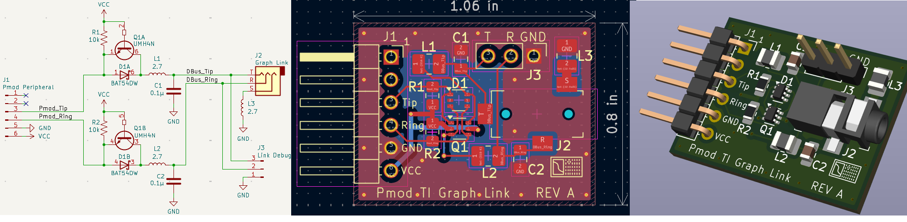

# Pmod TI Graph Link breakout board

This repository contains a schematic and PCB layout for a [Pmod](https://digilent.com/reference/pmod/specification)-compatible design that interfaces with TI graphing calculators and peripherals which use the 2.5mm TI graph link connector. The purpose of the board is make it convenient to connect to the calculator DBus without having to solder a cable, provide a convenient pin-out, and to translate the bus voltage to support 3.3V and 5V. The Pmod connectors are very common with FPGA development boards. The board is generic and can be used with any circuit in the 3.3-5V range, such as Arduinos, Raspberry Pis, or homebrew 6502 on breadboards.

The 6-pin Pmod connector supplies VCC, GND, and the two bi-directional tip and ring connections. For each tip and ring there are pull-up resistor, diode, and NPN transistor to allow interfacing with buses of different voltages and out to a 2.5mm stereo TRS jack. The board provisions for an LC low-pass filters for each tip and ring, similar to what is used in the USB silver graph link, TI keyboard, and TI graphing calculators. For debug, the layout provisions for an optional 1x3 header on the DBus side.

## Design

The design optimizes for performance and cost while still being something that
can be hand-soldered. The passives are 0805 or larger, through-hold connectors
were chosen where possible. The diode and transistor are on the smaller pitch,
but were chosen to combine dual components into a single package.

## Bill of Materials (BOM)

REF DES | Footprint | Type            | Manufacturer | Part #           |Qty|
--------|-----------|-----------------|--------------|------------------|---|
J1      | Pmod 0.1" | Pmod Connector  | METZ         | PR20206HBNN      | 1 |
J2      | Custom    | 2.5mm TRS audio | Kycon        | STX-2500-3NTR    | 1 |
J3      | 0.1"      | Debug header*   | METZ         | PR20203VBNN      | 1 |
Q1      | SOT-363   | Bias transistor | Toshiba Semi.| RN1911,LF        | 1 |
D1      | SOT-363   | Schottky diode  | Panjit       | BAT54DW_R1_00001 | 1 |
R1,R2   | 0805      | Pull-up Res.    | YAGEO        | RC0805JR-1310KL  | 2 |
C1,C2   | 0805      | Capacitor*      | YAGEO        | CC0805KRX7R9BB104| 2 |
L1,L2,L3| 1008      | Inductor*       | TDK          | NLV25T-2R7J-EF   | 3 |

(* denotes optional)

 ## Notes

 * [Digilent Pmod specification](https://digilent.com/reference/_media/reference/pmod/pmod-interface-specification-1_3_1.pdf)
 * [TI Graph Link Hardware Protocol](https://www.merthsoft.com/linkguide/hardware.html)
 * [Pmod TI graph link Cemetech forum post](https://www.cemetech.net/forum/viewtopic.php?t=20602)
